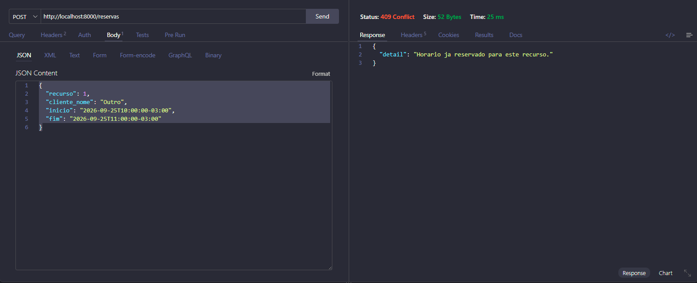
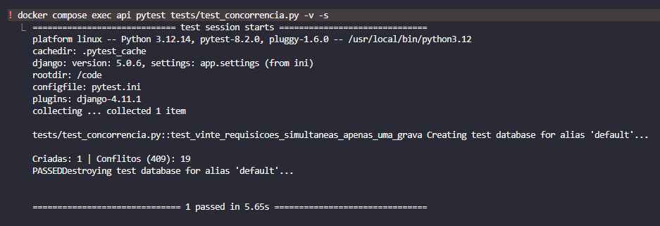

# Agendamento sem Conflito

API REST que garante que **duas reservas do mesmo recurso nunca se sobreponham**, mesmo quando varias requisicoes chegam no mesmo instante.

---

## Em palavras simples

Imagine uma sala de reuniao com uma agenda online. Duas pessoas abrem a tela no mesmo segundo, veem "10h livre" e clicam em reservar ao mesmo tempo.

O sistema verifica "esta livre?" para as duas — e nas duas a resposta e sim, porque nenhuma gravou ainda. Resultado: a sala fica reservada duas vezes no mesmo horario, e alguem descobre isso na hora da reuniao.

Este projeto resolve esse caso. A API recebe as duas tentativas, aceita uma e responde a outra com "horario ja reservado". Duas protecoes garantem isso:

1. **Uma fila invisivel** — quando alguem esta reservando a Sala A, as outras tentativas para a Sala A esperam sua vez. Quem chega depois ja enxerga a reserva gravada.
2. **Uma trava no banco de dados** — mesmo que o codigo tenha um erro no futuro, o proprio banco recusa qualquer reserva que se cruze com outra.

O teste automatizado prova: 20 pessoas tentando reservar o mesmo horario ao mesmo tempo, e apenas 1 consegue.

---

## O problema

Sistemas de agendamento costumam validar disponibilidade assim:

```python
if not Reserva.objects.filter(recurso=x, inicio__lt=fim, fim__gt=inicio).exists():
    Reserva.objects.create(...)
```

Parece correto, mas existe uma janela entre o `if` e o `create`. Se duas requisicoes chegam ao mesmo tempo, ambas passam pela verificacao antes de qualquer uma gravar — e o sistema aceita duas reservas para o mesmo horario.

Isso e uma **race condition**, e ela so aparece sob carga: em teste manual, um clique de cada vez, o bug nunca se manifesta.

---

## A solucao: duas camadas

### 1. Aplicacao — transacao com lock

```python
with transaction.atomic():
    Recurso.objects.select_for_update().get(pk=recurso_id)
    serializer.save()
```

O `select_for_update()` trava a linha do recurso no banco. Requisicoes concorrentes para o **mesmo recurso** passam a ser processadas uma de cada vez: a segunda espera a primeira encerrar a transacao e ja enxerga a reserva gravada.

### 2. Banco — constraint de exclusao

```sql
CREATE EXTENSION IF NOT EXISTS btree_gist;

ALTER TABLE core_reserva
ADD CONSTRAINT sem_sobreposicao
EXCLUDE USING gist (
    recurso_id WITH =,
    tstzrange(inicio, fim) WITH &&
);
```

O PostgreSQL passa a recusar qualquer insercao cujo intervalo cruze (`&&`) o de outra reserva do mesmo recurso. Vale para qualquer origem: a API, um script, o `psql`, um bug futuro no codigo.

O `btree_gist` e a extensao que permite combinar comparacao de igualdade (`recurso_id WITH =`) com comparacao de intervalo no mesmo indice GiST.

### Por que as duas

| Camada | Papel |
|---|---|
| Aplicacao | Serializa as requisicoes e devolve um erro limpo (`409 Conflict`) |
| Banco | Rede de seguranca — a sobreposicao e impossivel por definicao do schema |

Sozinha, a camada de aplicacao depende de o codigo estar sempre certo. Sozinha, a do banco funcionaria, mas o erro chegaria ao cliente como excecao crua.

---

## Provas

### Conflito barrado pelo banco



Com uma reserva das 10h as 11h ja gravada, qualquer tentativa que cruze esse intervalo recebe `409 Conflict`.

### Teste de concorrencia: 20 requisicoes simultaneas



O teste dispara 20 requisicoes em paralelo com `ThreadPoolExecutor`, todas pedindo exatamente o mesmo horario:

```
Criadas: 1 | Conflitos (409): 19
PASSED
```

Exatamente uma reserva gravada. Sem as duas camadas, o esperado seriam varias.

---

## Stack

| Camada | Tecnologia |
|---|---|
| Linguagem | Python 3.12 |
| Framework | Django 5 + Django REST Framework |
| Banco | PostgreSQL 16 |
| Containers | Docker + Docker Compose |
| Testes | pytest + pytest-django |
| CI | GitHub Actions |

---

## Como rodar

Pre-requisito: Docker Desktop instalado e em execucao.

```bash
git clone https://github.com/devlucasmoura/agendamento-sem-conflito.git
cd agendamento-sem-conflito

cp .env.example .env
docker compose up --build
```

Em outro terminal, aplique as migrations:

```bash
docker compose exec api python manage.py migrate
```

A API fica disponivel em `http://localhost:8000`.

---

## Endpoints

| Metodo | Rota | Descricao | Respostas |
|---|---|---|---|
| `POST` | `/recursos` | Cadastra um recurso (sala, equipamento, profissional) | `201` |
| `GET` | `/recursos` | Lista os recursos | `200` |
| `POST` | `/reservas` | Cria uma reserva | `201`, `400`, `409` |
| `GET` | `/reservas` | Lista as reservas | `200` |
| `DELETE` | `/reservas/{id}` | Cancela uma reserva | `204` |

### Exemplo

Criar um recurso:

```http
POST /recursos
Content-Type: application/json

{"nome": "Sala A"}
```

Criar uma reserva:

```http
POST /reservas
Content-Type: application/json

{
  "recurso": 1,
  "cliente_nome": "Moura",
  "inicio": "2026-09-25T10:00:00-03:00",
  "fim": "2026-09-25T11:00:00-03:00"
}
```

Resposta a uma tentativa sobreposta:

```json
{
  "detail": "Horario ja reservado para este recurso."
}
```

---

## Camadas de validacao

O projeto recusa entradas invalidas em tres pontos distintos:

| Situacao | Onde e barrada | Status |
|---|---|---|
| Formato de data invalido | Campo do DRF | `400` |
| `fim` anterior ao `inicio` | `validate()` do serializer | `400` |
| Horario sobreposto | Constraint do PostgreSQL | `409` |

Intervalos encostados nao conflitam: uma reserva das 10h as 11h e outra das 11h as 12h convivem, porque o range e `[inicio, fim)` — fechado no inicio, aberto no fim.

---

## Testes

```bash
docker compose exec api pytest -v -s
```

O `-s` exibe a contagem impressa pelo teste de concorrencia.

| Teste | O que verifica |
|---|---|
| `test_vinte_requisicoes_simultaneas_apenas_uma_grava` | 20 threads competindo pelo mesmo horario: 1 grava, 19 recebem `409` |

O CI executa a suite a cada push, contra um PostgreSQL real.

---

## Modelo de dados

```
Recurso
├── id
├── nome
└── criado_em

Reserva
├── id
├── recurso_id  ──> Recurso
├── cliente_nome
├── inicio
├── fim
└── criado_em

constraint: sem_sobreposicao
  EXCLUDE USING gist (recurso_id WITH =, tstzrange(inicio, fim) WITH &&)
```

---

## Estrutura

```
.
├── app/                 # configuracao do projeto Django
├── core/
│   ├── models.py        # Recurso e Reserva
│   ├── serializers.py   # validacao de entrada
│   ├── views.py         # transacao + lock + tratamento do 409
│   ├── urls.py          # rotas
│   └── migrations/
│       └── 0002_constraint_sem_sobreposicao.py
├── tests/
│   └── test_concorrencia.py
├── docs/                # evidencias
├── docker-compose.yml
├── Dockerfile
└── requirements.txt
```

---

## Licenca

MIT

---

## Autor
Lucas Moura
